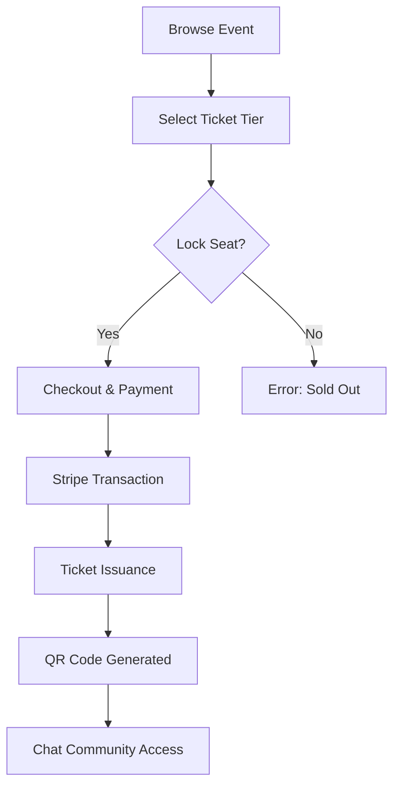

# 💼 EventMind: Business Operations & Process Guide

This document outlines the strategic value and user-centric operations of the EventMind marketplace.

---

## 👥 1. User Personas

| Persona | Motivation | Key Features |
| :--- | :--- | :--- |
| **The Attendee** | Discovery and Networking | Personalized feed, Real-time Chat, QR-Ticket Wallet. |
| **The Organizer** | Event Management & Sales | Analytics Dashboard, AI-Assisted Publishing, Revenue Tracking. |
| **System Agents** | Platform Integrity | Autonomous Moderation, Recommendation Scoring, Notification Triggers. |

---

## 🔄 2. Core Business Workflows

### 🛡️ A. Registration & Identity (Trust Layer)
EventMind follows a **High-Trust Onboarding** model:

1.  **Input**: User provides Name, Email, and Password.
2.  **Verification**: System creates a unique profile in the **User Service**.
3.  **Session Initiation**: Upon login, the **Auth Service** issues a high-security JSON Web Token (JWT).
4.  **Role Assignment**: Users can toggle between "Attendee" and "Organizer" modes seamlessly within the same account.

### 🔍 B. Discovery & Marketplace Experience

1.  **The Homepage**: A high-impact "Glassmorphic" grid featuring "Trending" and "For You" segments.
2.  **Smart Filtering**: Attendees can filter by **Category** (Workshops, Summits, Meetups) or **Date**.
3.  **Detail View**: Interactive event pages with price-tiers, speaker bios, and AI-moderated reviews.

### 🎟️ C. The Ticketing Lifecycle (Revenue Flow)
*EventMind ensures 100% data integrity for concurrent seat-buying.*

### 💰 D. Monetization Strategy
- **Commission Split**: Automated deduction of platform fees during the Stripe transaction.
- **Premium Upgrades**: Featured placement for organizers who want peak visibility in the Discovery grid.

---

## 📈 3. Key Business KPIs (Metrics for Success)
- **Time to List**: Average time from organizer entry to "Verified" status.
- **Attendee Engagement**: Frequency of interactions in event Chat communities.
- **Ticket Conversion Rate**: Ratio of "Event View" to "Successful Purchase".
