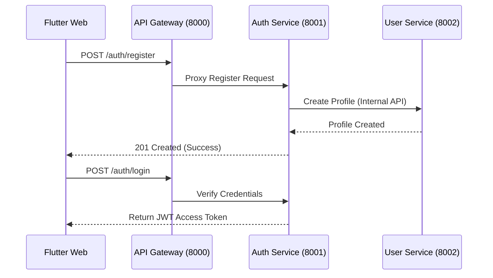

# ⚙️ EventMind: Deep Technical Reference

**EventMind** is built as a **Distributed, Data-Centric Architecture (DDCA)**, leveraging high-concurrency Python/FastAPI microservices.

---

## 🏛️ 1. Core Architecture Overview

| Component | Standard | Purpose |
| :--- | :--- | :--- |
| **Backend** | **Python 3.14 (FastAPI)** | High-throughput, asynchronous API backend. |
| **Frontend** | **Flutter Web (Dart)** | Low-latency UI with complex state management. |
| **Communication** | **Kafka & Redis** | Event-sourcing and real-time state caching. |
| **Identity** | **JWT (Auth0-style)** | Decentralized stateless authentication. |
| **Database** | **PostgreSQL** | Strict data isolation (one DB per service). |
| **Gateway** | **FastAPI Proxy** | Unified entry point for all 10 services. |

---

## 🛡️ 2. Authentication & Identity Flow

### 🔄 The Auth Handshake

---

## 🎟️ 3. Ticketing & Concurrent Safety

To prevent "overbooking," **EventMind** uses **Distributed Locking via Redis**:

1.  **Selection**: Attendee selects a ticket.
2.  **Reservation**: The **Ticketing Service** sets an EXPIRE-key in Redis (`event:123:tier:gold:lock`).
3.  **Payment**: Attendee has 10 minutes to finish the **Stripe** checkout.
4.  **Confirmation**: Once the **Payment Service** receives the webhook, it clears the Redis lock and updates the PostgreSQL inventory.

---

## 🤖 4. Agentic Workflows (The Data Mosaic)

We follow the **Observer Pattern** over Kafka:
1.  **ES (Event Service)** publishes an `event.published` message.
2.  **AS (Agent Service)** consumes the message and triggers its **CrewAI** agents (Mosaic Crew).
3.  **Agents** analyze the event and publish an `event.moderated` response.
4.  **ES** consumes the update and changes the event visibility to **Live**.
